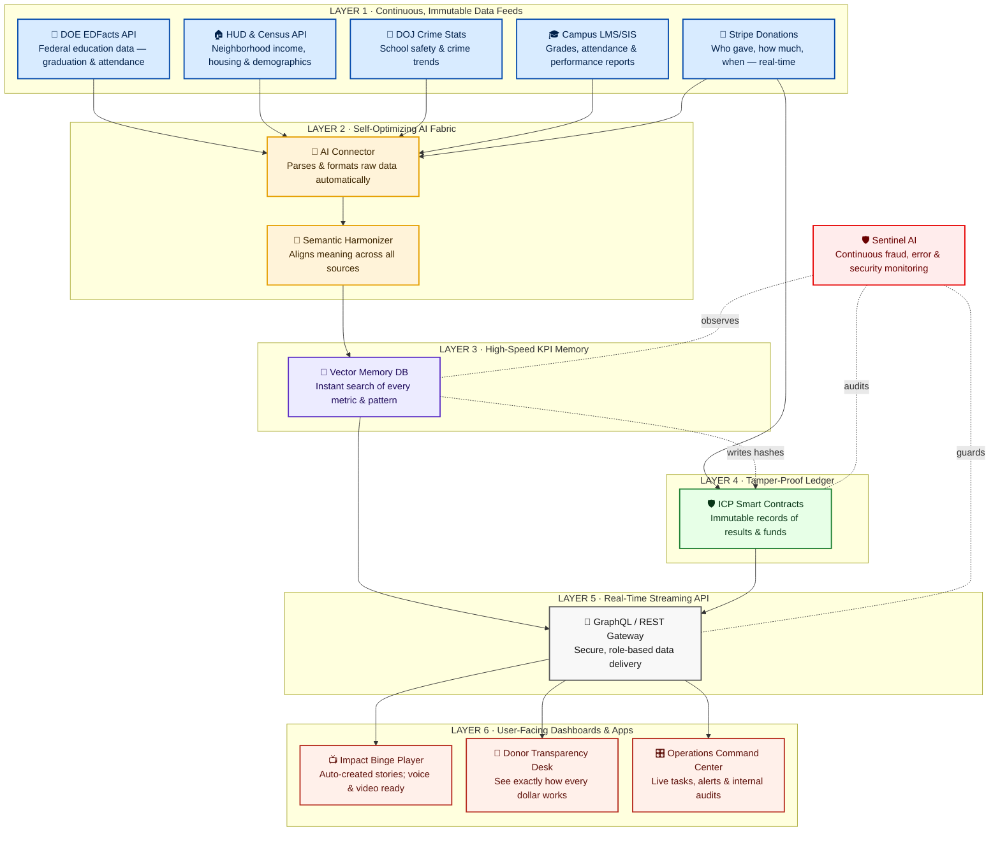

# Rooted & Rising – Immutable Trust Engine Architecture


> Mermaid source is included below for easy edits.
> The SVG above guarantees the diagram always shows, even if Mermaid has issues.

---

## 📐 Mermaid source



---

### 🔄 How to update the diagram

1. Open [https://mermaid.live](https://www.mermaidchart.com/app/projects/52f96f5a-3aac-4812-90c8-954dd2c42e7c/diagrams/cbe5c900-dc81-4ed2-a46f-41e54f28b622/version/v0.1/edit).
2. Paste the code block above and tweak any node or styling.
3. Export → **SVG** and overwrite `Rooted_Rising_Architecture.svg`.
4. Commit & push—GitHub will display both the static SVG and the live Mermaid source.

---

## 📁 Repo contents

```
/README.md                     ← this file
/Rooted_Rising_Architecture.svg← rendered SVG for quick preview
```

---

## 📝 License

Not MIT — Please do not fork, remix, or cite with a link back.

**Maintainer:** Styner Stiner · [stynerdev@gmail.com](mailto:stynerdev@gmail.com)
